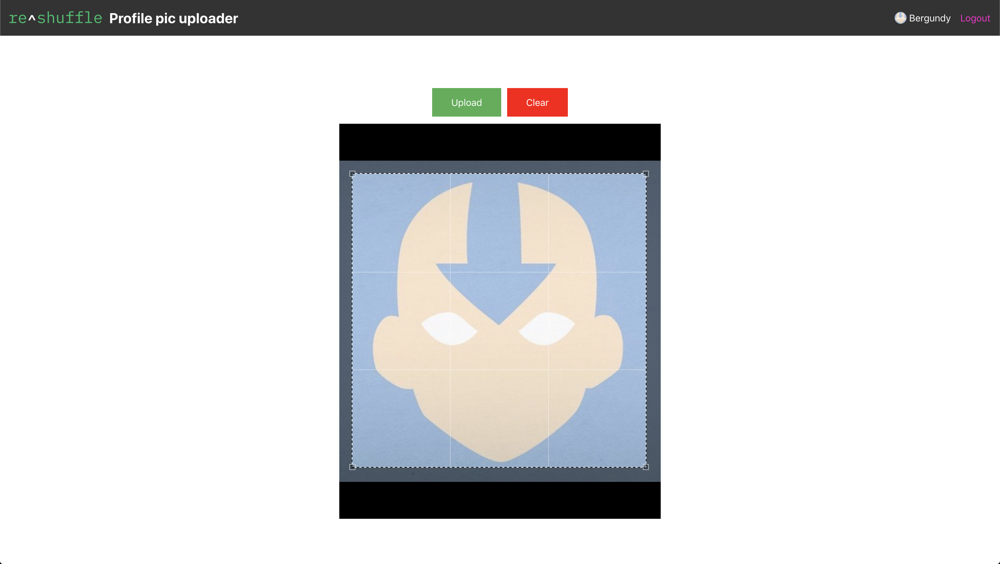

This is a [Reshuffle](https://reshuffle.com/) template.

## About

A starting point for storing user profile pictures with Reshuffle Storage.

Uses [react-dropzone](https://www.npmjs.com/package/react-dropzone) for Drag n' drop uploads and [react-image-crop](https://www.npmjs.com/package/react-image-crop) for cropping and scaling images in the browser.

This project was bootstrapped with [Create React App](https://github.com/facebook/create-react-app).

More info on the Reshuffle [dev site](https://dev.reshuffle.app/storage).

## Screenshots

